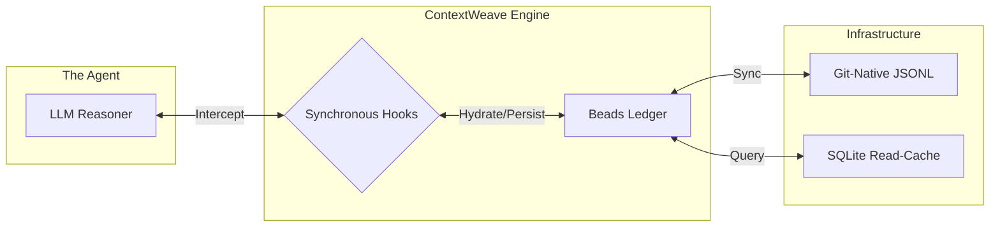

# ContextWeave: Cross-LLM Context Persister

[](https://github.com/yourusername/contextweave/actions/workflows/ci.yml)
[](https://opensource.org/licenses/MIT)

ContextWeave is a high-reliability **state management and policy enforcement framework** designed to solve "LLM amnesia" in autonomous agentic workflows. By utilizing a **Bead-Hook architecture**, it ensures stable context persistence across sessions, providers (Claude/Gemini), and workspace compactions.

---

## 🚀 Why ContextWeave?

As autonomous agents move from simple chat interfaces to long-horizon software engineering tasks, they encounter the **"Context Debt"** problem:
1.  **Context Exhaustion**: Large projects fill the context window with stale history, forcing the agent to forget critical architectural constraints.
2.  **Fragmented Tooling**: Switching between providers (e.g., using Gemini CLI for research and Claude Code for implementation) traditionally causes a total loss of session context.
3.  **Non-Deterministic Risk**: LLMs cannot reliably enforce security policies (like redacting secrets) within their own reasoning loop.

ContextWeave acts as the **deterministic operational anchor** for non-deterministic AI agents.

---

## 🏗️ Architecture Overview

ContextWeave bridges the gap between the LLM and the filesystem through a dual-layered approach.



### Key Technical Pillars:
-   **Beads Architecture**: A Git-native, append-only JSONL database for granular state management. It provides **idempotent memory** that is resilient to agent crashes and Git merge conflicts.
-   **Hook Lifecycle**: Synchronous deterministic scripts that execute at defined events (SessionStart, BeforeTool, AfterAgent) to enforce security policies and inject **Ordered Sequence Loading** for context rehydration.
-   **Cross-LLM Continuity**: Standardized mappers translate context between Claude Code and Gemini CLI, enabling seamless handoffs between providers.

---

## 📖 Architectural Decision Records (ADRs)

Deep systems thinking is prioritized over "just-in-case" features. Core design trade-offs are documented here:

-   [ADR 001: The Bead-Hook Persistence Model](docs/adr/001-bead-hook-persistence-model.md)
-   [ADR 002: Ordered Sequence Loading vs. Naive Context Dumping](docs/adr/002-ordered-sequence-loading.md)
-   [ADR 003: Deterministic Policy Enforcement via Hooks](docs/adr/003-deterministic-policy-hooks.md)

---

## 🛠️ Comparison: Why this over alternatives?

| Feature | ContextWeave | LangChain Memory | Markdown TODOs |
| :--- | :--- | :--- | :--- |
| **Data Format** | Append-only JSONL | In-memory / SQL | Unstructured Text |
| **Git Integration** | ✅ Native | ❌ No | ⚠️ Conflict-Prone |
| **Concurrency** | Parallel Agent Safe | ❌ No | ❌ No |
| **Policy Enforcement** | ✅ Deterministic Hooks | ❌ No | ❌ No |
| **Context Loading** | Topological Sort | ❌ Naive | ❌ Naive |

---

## ⚡ Quick Start

### 1. Installation
ContextWeave requires the `beads` CLI to be initialized in your workspace.

```bash
# Initialize Beads in your project
bd init --prefix CW
```

### 2. Configure Your CLI
ContextWeave provides hook scripts for both Gemini and Claude. Follow the provider-specific guides:
- [Setup Gemini CLI](setup-gemini.md)
- [Setup Claude Code](setup-claude.md)

### 3. Verify Persistence
Start a session, execute a task, and verify the trace in the Beads ledger:
```bash
# View the most recent prompt/final traces
bd list --all --sort created --reverse --limit 5
```

---

## 📝 Project Structure

- `hooks/*.js` — Lifecycle scripts (SessionStart, BeforeAgent, etc.)
- `mappers/` — Provider-specific payload normalization
- `payload.js` / `output.js` — High-level abstraction for CLI interoperability
- `trace-utils.js` — Core integration logic with the Beads database

---

© 2026 ContextWeave Project. Solving the AI memory problem with deterministic engineering.
