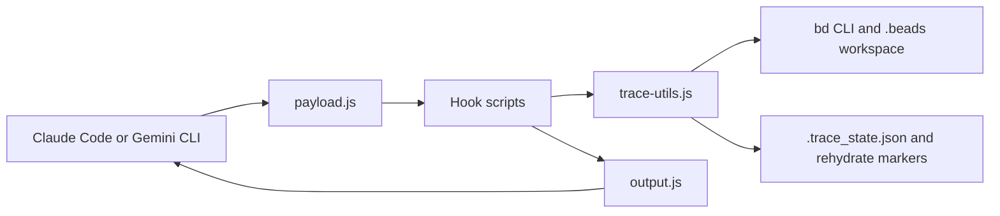

# ContextWeave

ContextWeave is a hook kit for Claude Code and Gemini CLI that persists prompt, tool, intermediate, and final traces into Beads and rehydrates working context after compaction. It gives long-running coding agents a deterministic memory layer without running a separate service.

Search terms: Claude Code hooks, Gemini CLI hooks, Beads memory, agent context persistence, AI coding assistant memory, prompt trace logging, compaction rehydration, cross-LLM context handoff.

## Why ContextWeave

- Normalize different provider payloads into one internal shape before trace handling.
- Persist prompt trees into Beads through the `bd` CLI instead of asking the model to maintain its own memory files.
- Rehydrate the agent with `bd prime --full`, recent prompt/final summaries, and open work after session start or compaction.
- Detect interrupted prompts and annotate them when a new prompt arrives before a final response is logged.
- Stay operationally simple: plain Node scripts, provider hook bindings, and a `.beads` workspace.

## Quick Start

Initialize Beads in the target workspace:

```bash
bd init --prefix CW
```

Clone this repo and note its absolute path. Then:

1. Follow [setup.md](setup.md) for prerequisites and setup flow.
2. Pick a provider guide:
   - [setup-claude.md](setup-claude.md)
   - [setup-gemini.md](setup-gemini.md)
3. Run one prompt through the provider.
4. Inspect the resulting Beads trace:

```bash
bd list --all --sort created --reverse --limit 5
```

## Architecture Snapshot



The hooks do two jobs: they inject the right working context back into the model and they persist a structured prompt tree that you can inspect later with Beads.

## Docs Map

- [Setup Overview](setup.md): prerequisites, common behavior, and provider selection.
- [Claude Code Setup](setup-claude.md): Claude-specific event bindings and output-mode notes.
- [Gemini CLI Setup](setup-gemini.md): Gemini-specific event bindings and rehydration flow.
- [Architecture](docs/architecture.md): provider normalization, hook flow, persistence model, and compaction behavior.
- [Trace Model](docs/trace-model.md): trace issue types, helper files, environment variables, and inspection commands.
- [ADR 001](docs/adr/001-bead-hook-persistence-model.md): why Beads plus hooks is the persistence model.
- [ADR 002](docs/adr/002-ordered-sequence-loading.md): why rehydration is summary- and dependency-aware.
- [ADR 003](docs/adr/003-deterministic-policy-hooks.md): why deterministic hooks sit outside the model loop.

## Current Implementation Notes

- The scripts are plain CommonJS files in the repo root; there is no build step.
- The code expects `bd` to be available on `PATH`.
- Trace sequencing state is stored in `.beads/.trace_state.json`.
- Rehydration uses marker files such as `.beads/.needs_rehydrate` and `.beads/.beads_bootstrap_done`.
- Gemini logs intermediate chunks via `AfterModel`; Claude does not expose the same hook event, so intermediate traces are not available there.
