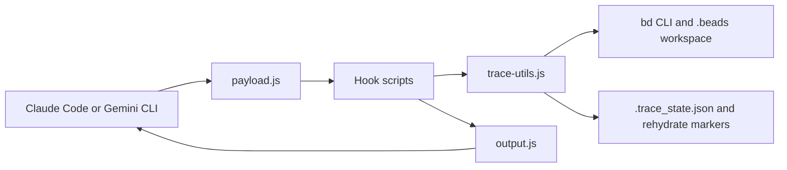

# ContextWeave

ContextWeave is a hook kit for Claude Code and Gemini CLI that persists prompt, tool, intermediate, and final traces into Beads and rehydrates working context after compaction. It gives long-running coding agents a deterministic memory layer without running a separate service.

Search terms: Claude Code hooks, Gemini CLI hooks, Beads memory, agent context persistence, AI coding assistant memory, prompt trace logging, compaction rehydration, cross-LLM context handoff.

## Why ContextWeave

- Normalize different provider payloads into one internal shape before trace handling.
- Persist prompt trees into Beads through the `bd` CLI instead of asking the model to maintain its own memory files.
- Rehydrate the agent with `bd prime --full`, recent prompt/final summaries, and open work after session start or compaction.
- Detect interrupted prompts and annotate them when a new prompt arrives before a final response is logged.
- Expose `search-beads` — a semantic retrieval tool backed by a local ONNX model (`all-MiniLM-L6-v2`) that lets the model dig deeper into history via its native Bash/shell tool without MCP.
- Stay operationally simple: plain Node scripts, provider hook bindings, a `.beads` workspace, and a local model cache.

## Quick Start

```bash
# 1. Initialize Beads in your project
bd init --prefix CW

# 2. Clone, install, then delete the repo — it is not needed after setup
git clone https://github.com/vinay9986/ContextWeave
cd ContextWeave
node install.js
cd .. && rm -rf ContextWeave
```

The installer copies everything to `~/.contextweave/`, links `search-beads` onto your PATH, and prints the exact hook config block to paste into your provider settings file.

3. Paste the printed config into `~/.claude/settings.json` (Claude Code) or `~/.gemini/settings.json` (Gemini CLI).
4. Run one prompt through the provider.
5. Inspect the resulting Beads trace:

```bash
bd list --all --sort created --reverse --limit 5
```

See [setup.md](setup.md) for full details, and [setup-claude.md](setup-claude.md) / [setup-gemini.md](setup-gemini.md) for provider-specific notes.

## Architecture Snapshot



The hooks do two jobs: they inject the right working context back into the model and they persist a structured prompt tree that you can inspect later with Beads.

## Docs Map

- [Setup Overview](setup.md): prerequisites, common behavior, and provider selection.
- [Claude Code Setup](setup-claude.md): Claude-specific event bindings and output-mode notes.
- [Gemini CLI Setup](setup-gemini.md): Gemini-specific event bindings and rehydration flow.
- [Architecture](docs/architecture.md): provider normalization, hook flow, persistence model, and compaction behavior.
- [Trace Model](docs/trace-model.md): trace issue types, helper files, environment variables, and inspection commands.
- [ADR 001](docs/adr/001-bead-hook-persistence-model.md): why Beads plus hooks is the persistence model.
- [ADR 002](docs/adr/002-ordered-sequence-loading.md): why rehydration is summary- and dependency-aware.
- [ADR 003](docs/adr/003-deterministic-policy-hooks.md): why deterministic hooks sit outside the model loop.

## Benchmark Results

Evaluated on [LongMemEval](https://arxiv.org/abs/2410.10813) (ICLR 2025) — 400 questions across six long-term memory abilities, using Claude Sonnet 4.6 via AWS Bedrock.

| Condition | Accuracy | Avg Input Tokens |
|---|---|---|
| Baseline — full conversation context | 59.5% | 115,660 |
| **ContextWeave — bead retrieval** | **68.2%** | **102,791** |

**+8.7 percentage points accuracy at 11% lower token cost.**

By question type:

| Question Type | Baseline | ContextWeave | Delta |
|---|---|---|---|
| single-session-user | 80% | **94%** | +14pp |
| single-session-assistant | 93% | 93% | — |
| single-session-preference | 17% | **57%** | +40pp |
| multi-session | 57% | **65%** | +8pp |
| temporal-reasoning | 20% | **34%** | +14pp |
| knowledge-update | **78%** | 72% | −6pp |

The biggest gains are on preference recall (+40pp) and temporal reasoning (+14pp), where the structured bead index outperforms searching a 115K-token context window. The one regression is knowledge-update, where the baseline benefits from seeing every fact update in-order in full context.

The benchmark runner lives in [`benchmarks/longmemeval-ab/`](benchmarks/longmemeval-ab/).

## Current Implementation Notes

- The scripts are plain CommonJS files in the repo root; there is no build step.
- The code expects `bd` to be available on `PATH`.
- Trace sequencing state is stored in `.beads/.trace_state.json`.
- Rehydration uses marker files such as `.beads/.needs_rehydrate` and `.beads/.beads_bootstrap_done`.
- Gemini logs intermediate chunks via `AfterModel`; Claude does not expose the same hook event, so intermediate traces are not available there.
