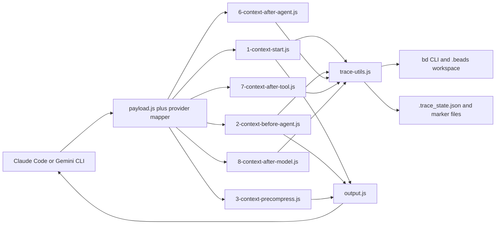

# ContextWeave Architecture

ContextWeave is a provider-hook layer around Beads. It does not run as a daemon and it does not maintain its own database service.

## Runtime Topology

The scripts are small because almost all persistence and summary logic is centralized in [../trace-utils.js](../trace-utils.js).

## Provider Normalization

`payload.js` reads JSON from stdin, detects the provider, and maps the raw hook payload into a shared structure:

- `prompt`
- `final`
- `tool`
- `chunk`
- `session_id`
- `timestamp`
- `transcript_path`
- `cwd`

Provider-specific mapping lives in:

- [../mappers/claude.js](../mappers/claude.js)
- [../mappers/gemini.js](../mappers/gemini.js)

## Hook Responsibilities

| Script | Responsibility |
| --- | --- |
| `1-context-start.js` | Inject `bd prime --full`, prompt/final summaries, and open issues at session start. |
| `2-context-before-agent.js` | Log a new prompt, handle post-compaction rehydration, and inject memory reminders. |
| `3-context-precompress.js` | Remind the agent to persist durable work and mark the workspace for rehydration. |
| `4-context-postcompress.js` | Optional post-compression rehydration helper. Present in the repo but not used by the default provider configs. |
| `5-context-end.js` | Silent session-end hook. |
| `6-context-after-agent.js` | Log the final response for the current prompt. |
| `7-context-after-tool.js` | Log tool call and tool result snippets. |
| `8-context-after-model.js` | Log intermediate output chunks for Gemini. |

## Persistence Model

ContextWeave uses two storage layers:

1. Beads issues created through the `bd` CLI
2. Lightweight local state files inside `.beads/`

### Beads trace tree

- Prompt issues are the parent nodes.
- Final responses, tool calls, tool results, and intermediate chunks are child issues.
- Labels such as `trace`, `prompt`, `tool_call`, `tool_result`, `intermediate`, and `final` distinguish the record type.

### Local state files

- `.beads/.trace_state.json` tracks prompt sequence numbers, step sequence numbers, and the current prompt ID.
- `.beads/.needs_rehydrate` tells the next prompt to inject a post-compaction context pack.
- `.beads/.beads_bootstrap_done` prevents the one-time bootstrap reminder from repeating.

## Compaction and Rehydration

The compaction flow is deterministic:

1. `3-context-precompress.js` sets `.beads/.needs_rehydrate`.
2. The provider compacts its own session history.
3. On the next prompt, `2-context-before-agent.js` sees the marker.
4. The hook injects:
   - `bd prime --full`
   - a compact memory pack built from pinned, decision, and ready issues
   - a recent prompt/final summary
5. The marker is removed.

## Interrupted Prompt Detection

When a new prompt arrives, `trace-utils.js` checks whether the previous prompt ever received a final node.

- If not, the earlier prompt is labeled `interrupted` and closed.
- If the transcript shows a cancellation event between prompts, the interruption reason is recorded as `request_cancelled`.
- The last child snippet is attached so the incomplete trace still has useful state.

## Output Handling

`output.js` formats hook output differently per provider:

- Claude defaults to plain-text-safe output for `UserPromptSubmit` unless `CLAUDE_HOOK_MODE=json` is set.
- Gemini returns JSON with `hookSpecificOutput.additionalContext`.

This keeps context injection compatible with provider-specific hook requirements without duplicating trace logic.

## What ContextWeave Is Not

- Not a standalone memory server
- Not a vector database
- Not a JSONL event bus
- Not a replacement for Beads itself

It is a deterministic bridge between provider hook events and a Beads-backed memory workflow.
